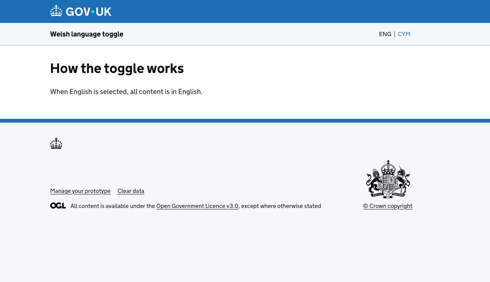
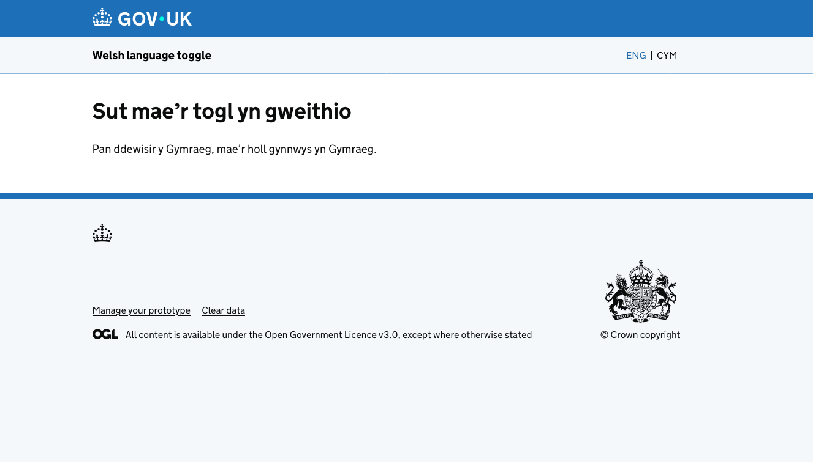
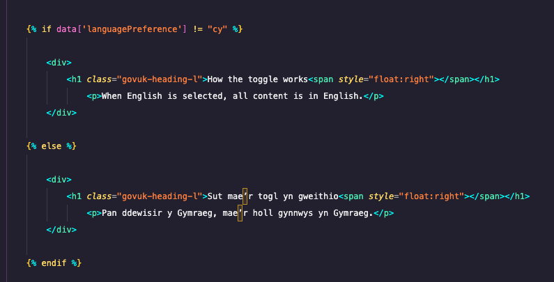

# Welsh language toggle

This GOV.UK Prototype Kit example lets visitors switch between English and Welsh using the language selector in the service navigation header. Both translations live in the same page template, so you can maintain one set of pages instead of separate English and Welsh journeys.

English is the default. Selecting **Cymraeg** changes the page content to Welsh; selecting **English** changes it back. The selected language is stored in the visitor's session and used by other pages that read `data['languagePreference']`.

The selector does not translate content automatically. You need to supply both translations in each page. In this example, the home page heading and paragraph change language; the service name and `pageName` remain in English.

## Example screens

English:



Welsh:



## Run the example

From the project folder, run:

```sh
npm ci
npm run dev
```

Open http://localhost:3000 and use the language selector in the header. The example page is `app/views/index.html`.

This project uses GOV.UK Prototype Kit 13.20.5, GOV.UK Frontend ^6.5.1 and HMRC Frontend ^7.38.0, as declared in `package.json`.

## Add the toggle to another prototype

### 1. Install HMRC Frontend

In a compatible GOV.UK Prototype Kit project, install HMRC Frontend:

```sh
npm install hmrc-frontend@latest
```

The `@latest` tag installs the latest published release when you run the command. To update an existing installation later, run the same command again. Commit both `package.json` and `package-lock.json` after installing or updating.

This repository already includes HMRC Frontend. The current header uses `hmrcHeader` and `hmrcServiceNavigationLanguageSelect`, rather than the older `hmrcLanguageSelect` example previously documented here.

### 2. Add the selector to the shared layout

Use the following in `app/views/layouts/main.html`. If your layout already has a custom header, merge these changes into it.

```njk





  

  



  {{ hmrcHeader({
    isWelshTranslationAvailable: true,
    serviceNavigation: {
      serviceName: "Welsh language toggle",
      classes: 'hmrc-service-navigation--with-language-select',
      slots: {
        end: {
          html: hmrcServiceNavigationLanguageSelect({
            language: currentLang,
            en: { href: '?languagePreference=en' },
            cy: { href: '?languagePreference=cy' }
          })
        }
      }
    }
  }) }}

```

Change `serviceName` to your own service name. The selector links reload the current page with `?languagePreference=en` or `?languagePreference=cy`. This layout puts the selector in the header for every page that extends it; you do not need to add a separate `beforeContent` block to each page.

### 3. Remember the selected language

In `app/routes.js`, after setting up the router and before adding your own routes, include this middleware:

```js
const govukPrototypeKit = require('govuk-prototype-kit')
const router = govukPrototypeKit.requests.setupRouter()

// Persist language selection across the prototype
router.use((req, res, next) => {
  req.session.data = req.session.data || {}

  // Default to English once per session
  if (typeof req.session.data.languagePreference === 'undefined') {
    req.session.data.languagePreference = 'en'
  }

  // Accept several possible query keys (header macro may use ?lang=cy)
  const q =
    (req.query.languagePreference ||
     req.query.lang ||
     req.query.language ||
     req.query.locale ||
     '').toString().toLowerCase()

  if (q === 'cy' || q === 'en') {
    req.session.data.languagePreference = q
  }

  next()
})
```

If your routes file already sets up `govukPrototypeKit` and `router`, keep those declarations once and add only the `router.use(...)` block.

The middleware defaults the session to English and accepts `en` or `cy` from the query parameters `languagePreference`, `lang`, `language` or `locale`. The header in this prototype uses `languagePreference`. Other values do not change the stored preference.

### 4. Supply English and Welsh content in each page

Pages should extend the shared layout and use `data['languagePreference']` to select the content. For example:

```njk





  
    <h1 class="govuk-heading-l">How the toggle works</h1>
    <p>When English is selected, all content is in English.</p>
  
    <h1 class="govuk-heading-l">Sut mae’r togl yn gweithio</h1>
    <p>Pan ddewisir y Gymraeg, mae’r holl gynnwys yn Gymraeg.</p>
  

```

The conditional content in the example page:



Repeat the content condition wherever you need translated text, including other pages. The header selector is shared, but each page must provide its own translations. Translate page titles, service names and other interface text too if you need a fully bilingual journey.
